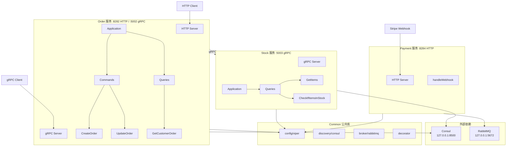
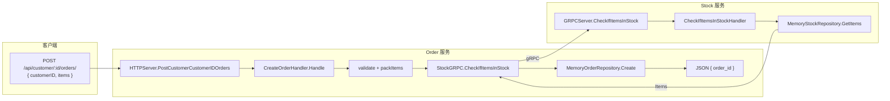
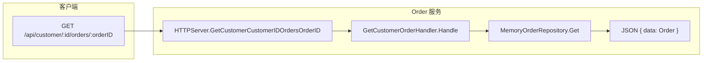
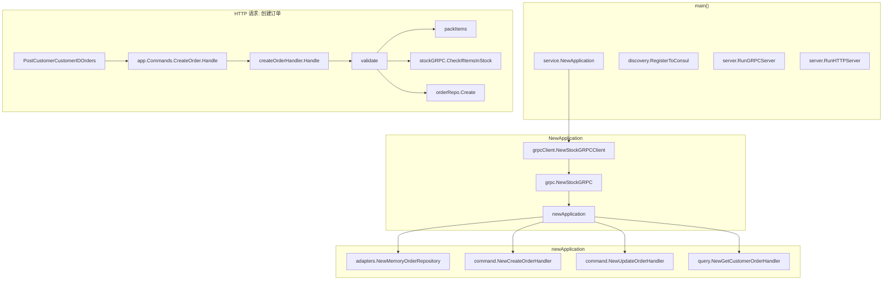
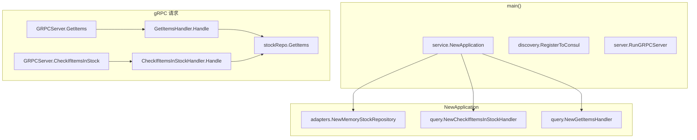
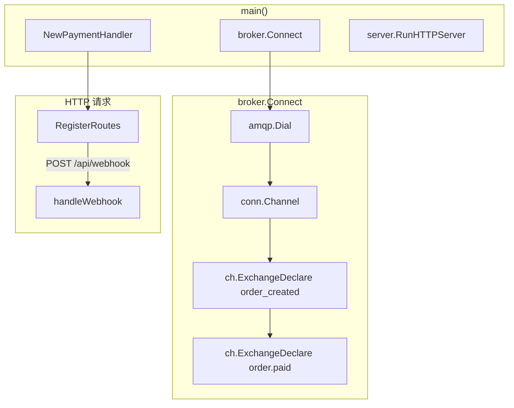
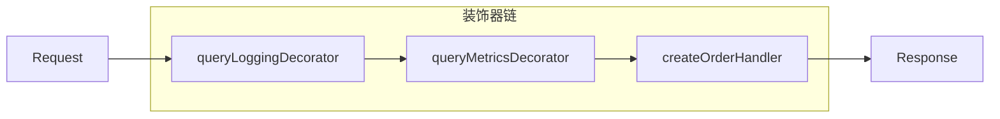
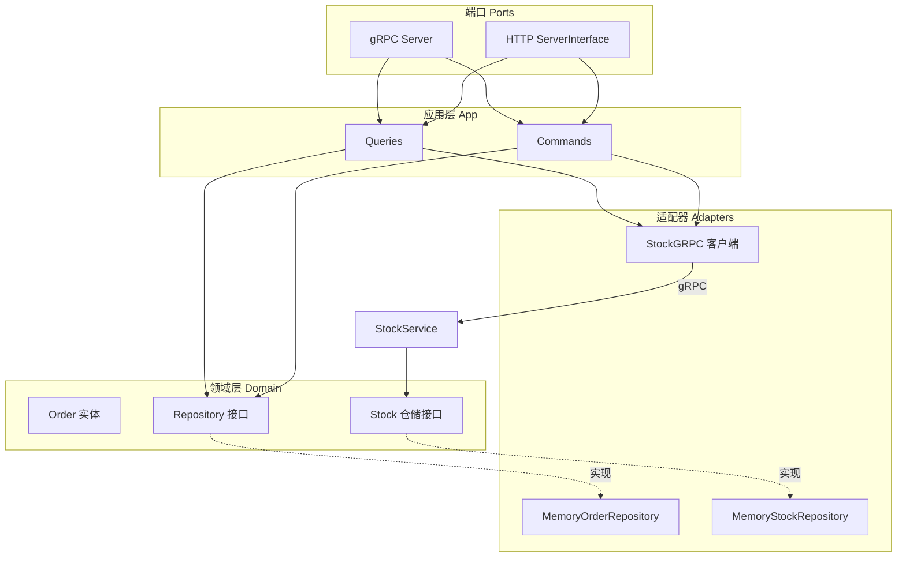
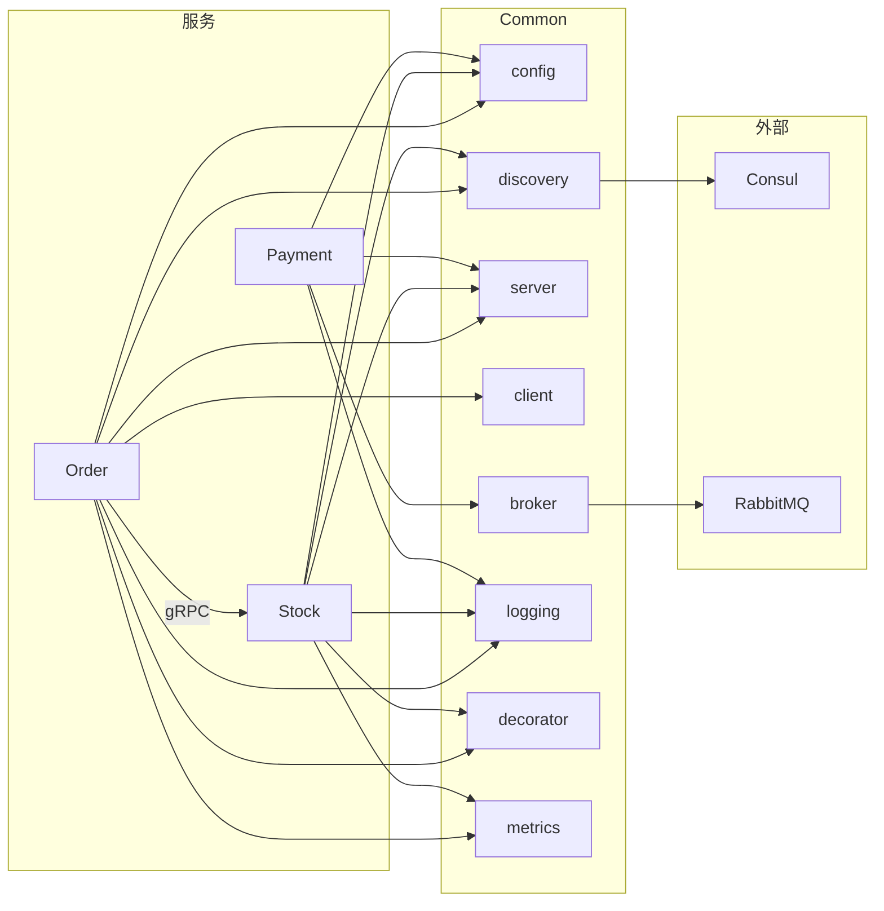

# go_miserver3 架构与流程图

> 使用 Mermaid 语法，可在 GitHub、VS Code、Typora 等支持 Mermaid 的编辑器中渲染。

---

## 1. 整体系统架构图



---

## 2. 数据流图

### 2.1 创建订单数据流



### 2.2 查询订单数据流



### 2.3 Stock 服务数据流（Order 调用）

```mermaid
flowchart TB
    subgraph Order["Order 服务"]
        CreateOrder[CreateOrderHandler]
        StockGRPC[StockGRPC 适配器]
    end

    subgraph Stock["Stock 服务"]
        Port[GRPCServer]
        GetItems[GetItemsHandler]
        CheckStock[CheckIfItemsInStockHandler]
        Repo[MemoryStockRepository]
    end

    CreateOrder -->|CheckIfItemsInStock| StockGRPC
    StockGRPC -->|gRPC :5003| Port
    Port --> CheckStock
    Port --> GetItems
    CheckStock --> Repo
    GetItems --> Repo
    Repo -->|orderpb.Item[]| Port
```

---

## 3. 函数调用图

### 3.1 Order 服务启动与请求调用链



### 3.2 Stock 服务函数调用链



### 3.3 Payment 服务函数调用链



### 3.4 装饰器调用链（Command/Query）



---

## 4. 分层架构图（端口与适配器）



---

## 5. 服务依赖关系图


